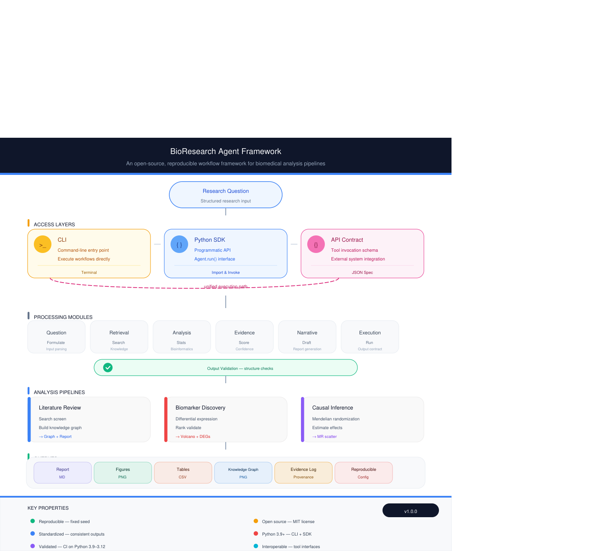
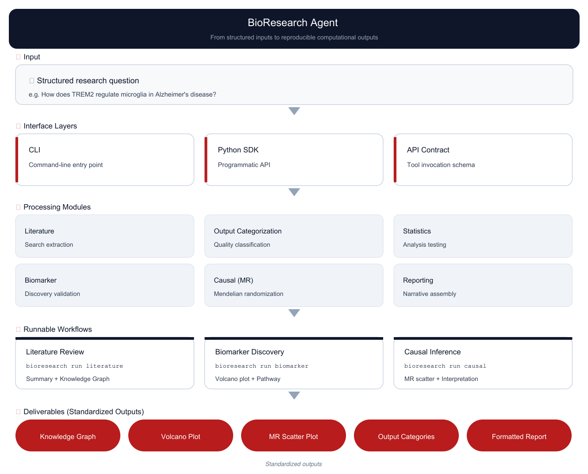
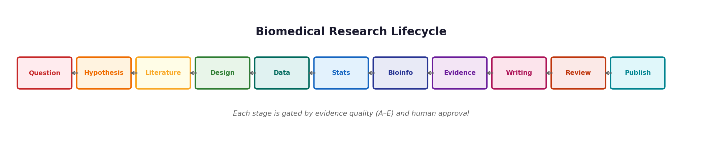

# BioResearch Agent Framework

> **Give AI assistants real biomedical research capabilities.** Run reproducible literature analysis, biomarker discovery, and causal inference workflows through executable agent skills — not text-only summaries.

CLI · Python SDK · API · Agent Skills

**What your AI assistant can do after installing the skills:**

- 📚 **Literature analysis** — PubMed retrieval + entity co-occurrence knowledge graph → structured review & research-gap outline
- 🧬 **Biomarker discovery** — DEG + GO/KEGG enrichment + candidate ranking, validated on real GEO data (e.g. GSE7621 PD)
- 🔗 **Causal-evidence chain** — full GWAS → eQTL → colocalization → TWAS → fine-mapping → MR (goes far beyond plain MR)
- 🌍 **Cross-ancestry MR** — CAUSE/MRMix pleiotropy modeling + portability across EUR/EAS/SAS/AFR/AMR
- 🧫 **Single-cell foundation embeddings** — scGPT / UCE / scFoundation cell-type recovery (mock-validated; live mode on GPU)
- 🧭 **Deterministic Agent Router** — rule-based intent → workflow mapping (no LLM; identical input → identical route)
- 🔬 **Reproducible & honestly graded** — 9-case validation suite on real public data, evidence graded A/B/C; controlled-access data excluded by design

[](https://github.com/Alim430/bioresearch-agent/actions/workflows/ci.yml)
[](https://www.python.org/downloads/)
[](https://opensource.org/licenses/MIT)
[](https://github.com/Alim430/bioresearch-agent/releases/latest)

---

<div align="center">



*Reproducible biomedical workflow framework: 3 analysis pipelines &middot; 6 processing modules &middot; standardized execution outputs*

</div>

---

## 🖼️ What It Produces

One image shows the real outputs of all three workflows — understand what this is in 3 seconds, no reading required:

<div align="center">


*Left: literature co-occurrence knowledge graph &middot; Middle: differential-expression volcano plot &middot; Right: MR scatter plot — covering Literature / Biomarker / Causal scenarios.*

</div>

---

## ⚡ Quick Start

BioResearch Agent offers two ways to use it: **(1) as AI Agent Skills** — drop the workflows into your AI assistant so it can *run* real analyses; or **(2) as a Python framework** — call the CLI/SDK directly. Both share the same reproducible engine.

### Option 1 — Install as AI Agent Skills *(Recommended)*

Give your AI assistant (Claude, Cursor, Codex, and other Agent Skills–compatible clients) the ability to execute real biomedical pipelines:

```bash
git clone https://github.com/Alim430/bioresearch-agent.git
cd bioresearch-agent
./skills/install.sh
```

After installation, ask your assistant things like:

> *"Run a literature review on microglia in Alzheimer's disease"*
> *"Find biomarker candidates for Parkinson's disease"*
> *"Test the causal effect of BMI on Type 2 Diabetes"*

and it will dispatch to the underlying `bioresearch` workflows — producing data-derived tables and figures — instead of generating unsupported analysis claims.

<details>
<summary>Manual install / other clients</summary>

```bash
# Claude Desktop (macOS) — copy every active skill leaf folder (14 skills)
cp -r skills/core/project-introduction \
      skills/core/environment-check \
      skills/core/agent-router \
      skills/biomedical/literature-analysis \
      skills/biomedical/biomarker-discovery \
      skills/biomedical/differential-expression \
      skills/biomedical/pathway-enrichment \
      skills/biomedical/causal-inference \
      skills/biomedical/causal-evidence \
      skills/biomedical/disease-case-study \
      skills/biomedical/foundation-embeddings \
      skills/biomedical/ld-reference-management \
      skills/biomedical/gwas-harmonization \
      skills/biomedical/ancestry-aware-mr \
      "$HOME/Library/Application Support/Claude/skills/"

# Cursor:  same command, target ~/.cursor/skills/
# Codex / generic:  target ~/.config/agent/skills/
```

Restart the client after copying. See [Workflow Skills](#-workflow-skills) and
[skills/README.md](skills/README.md) for the full capability map.

</details>

### Option 2 — Use as a Python framework

```bash
git clone https://github.com/Alim430/bioresearch-agent.git
cd bioresearch-agent
pip install -e .
bioresearch doctor                       # verify installation
bioresearch run literature --query "microglia Alzheimer's disease"
bioresearch run biomarker --disease "Parkinson's disease"
bioresearch run causal   --exposure BMI --outcome "Type 2 Diabetes"
```

**Demos require no LLM key** — they run on public APIs + synthetic fallback data. Full command reference in [Three Commands](#-three-commands-three-workflows).

---

## 🔄 Workflow Overview

From structured research inputs to reproducible computational outputs:

<div align="center">



</div>

**Core design:** Workflows provide standardized execution interfaces over existing biomedical analysis tools. Computational methods remain delegated to domain-specific libraries (limma, GSEA, TwoSampleMR). The framework defines explicit execution stages and standardized outputs for reproducible workflow organization.

## 🔁 12-Stage Execution Diagram

Stages 1&ndash;8 (Question &rarr; Hypothesis &rarr; Literature &rarr; Design &rarr; Data &rarr; Stats &rarr; Bioinfo &rarr; Output) are implemented in the current release. Stages 9&ndash;12 (Writing &rarr; Review &rarr; Critique &rarr; Publication) represent conceptual extensions toward end-to-end research organization and are not automated.

<div align="center">



*Execution diagram across 12 stages. Stages 1&ndash;8 are implemented; stages 9&ndash;12 are conceptual and not automated.*

</div>

---

## 🏗️ Architecture

<div align="center">


</div>

| Layer | Responsibility |
|:---|:---|
| **User Interface** | CLI &middot; Python SDK &middot; API contract (tool spec) |
| **Workflow** | literature / biomarker / causal (extensible) |
| **Processing Modules &middot; 6 Components** | Question &rarr; Retrieval &rarr; Analysis &rarr; Evidence &rarr; Narrative &rarr; Execution |
| **Execution Stages &middot; 12-Stage Diagram** | Question &rarr; … &rarr; Output; 8 implemented / 4 conceptual |
| **External Tool Interfaces** | PubMed &middot; GEO &middot; KEGG &middot; GO &middot; GWAS &middot; DESeq2 &middot; IVW-MR |

---

## 🎯 What It Does

**BioResearch Agent Framework** is a runnable biomedical workflow framework that integrates existing analysis tools through standardized execution interfaces.

| Capability | Description |
|:---|:---|
| Literature analysis | PubMed retrieval, entity extraction, co-occurrence analysis |
| Omics analysis | Differential expression and pathway enrichment workflows |
| Causal analysis | Mendelian randomization workflows |
| Structured reporting | Standardized tables, figures, and workflow outputs |

**Key difference:** The framework executes reproducible computational workflows rather than generating text-only summaries. Outputs include data-derived tables, statistical results, and formatted figures.

---

## 🧮 Evidence Scoring & Hard Quality Control

BioResearch Agent ships a small, **deterministic** evidence-scoring contract and a hard
quality-control layer. These are *framework utilities*, not autonomous reasoning: every
computation is a fixed numerical aggregation with no LLM involvement.

### Scorer plugin interface

The public framework exposes one abstract contract — `EvidenceScorer` — plus a default
implementation (`DefaultMultiModalScorer`) and an in-memory registry (`PluginRegistry`).
Domain-specific scorers (e.g. a private AD-VCP candidate-ranking system) plug in via this
interface and are **not** distributed with the public repository.

```python
from bioresearch.scorer import EvidenceScorer, EvidenceLayer, PluginRegistry

class MyScorer(EvidenceScorer):
    @property
    def name(self): return "MyScorer"
    @property
    def supported_layers(self): return ["genetic", "functional", "population"]
    def validate_layers(self, layers): return any(l.qc_passed for l in layers)
    def score(self, gene, evidence_layers, context=None):
        # deterministic aggregation of qc_passed layers -> ScoredGene
        ...

reg = PluginRegistry()
reg.register(MyScorer(), set_default=True)
```

A ready-made synthetic example lives in `demo_plugins/trivial_scorer.py` (**fake data only** —
no real genes, no publication data). Third-party scorers can also register through the
`bioresearch.scorers` entry-point group declared in `setup.py`.

### Hard quality-control assertions

`bioresearch.quality.assertions` enforces non-negotiable statistical gates. A `CRITICAL`
gate with action `REJECT` raises `HardStopException` and stops the pipeline:

| Assertion | Threshold | Action |
|:---|:---|:---|
| `mr_weak_iv` | instrument strength F ≥ 10 | REJECT |
| `rnaseq_low_mapping` | alignment rate ≥ 70% | REJECT |
| `scrnaseq_low_umi` | median UMI ≥ 500 | REJECT |
| `mr_pleiotropy` | MR-Egger intercept p ≥ 0.05 | WARN |
| `coloc_weak` | PP.H4 ≥ 0.8 | WARN |
| `multiple_testing_unadjusted` | BH q ≤ 0.05 | WARN |

### Data-governance interceptor

`bioresearch.quality.governance` blocks controlled-access / individual-level sources
(MetaBrain, UKB-PPP, ADNI, deCODE, personal genome) before any load — see
[Data & Network Access](#-data--network-access) and `DATA_GOVERNANCE.md`. The framework
processes only public, de-identified, or summary-level data.

---

## 🚀 Three Commands, Three Workflows

### 1. Literature Review
```bash
bioresearch run literature --query "microglia Alzheimer's disease"
```
PubMed retrieval &rarr; abstract extraction &rarr; entity co-occurrence knowledge graph &rarr; research-gap identification &rarr; structured review outline.
**Outputs:** `lit_review_summary_table.csv` &middot; `lit_review_knowledge_graph.png` &middot; `lit_review_knowledge_gaps.txt` &middot; `lit_review_outline.md`

### 2. Biomarker Discovery
```bash
bioresearch run biomarker --disease "Parkinson's disease"
```
GEO dataset (GSE7621) or synthetic &rarr; differential expression (t-test + Bonferroni) &rarr; hypergeometric pathway enrichment (KEGG/GO) &rarr; candidate ranking &rarr; volcano plot.
**Outputs:** `biomarker_deg_table.csv` &middot; `biomarker_top_candidates.csv` &middot; `biomarker_pathway_enrichment.csv` &middot; `biomarker_volcano_plot.png` &middot; `biomarker_report.txt`

### 3. Causal Inference (MR)
```bash
bioresearch run causal --exposure BMI --outcome "Type 2 Diabetes"
```
Simulated GWAS summary stats &rarr; genome-wide significant SNP instruments &rarr; IVW estimation &rarr; leave-one-out sensitivity &rarr; MR scatter / funnel plots.
**Outputs:** `causal_ivw_results.csv` &middot; `causal_loo_results.csv` &middot; `causal_mr_scatter.png` &middot; `causal_mr_funnel.png` &middot; `causal_interpretation.txt`

---

## 📊 Example Workflow Outputs

| Workflow | Representative Figure | Size |
|:---|:---|:---:|
| Literature | entity co-occurrence knowledge graph (40 entities / 30 abstracts) | varies |
| Biomarker | formatted volcano plot (DEG analysis) | 86 KB |
| Causal | MR scatter plot (IVW slope labeled) + funnel | 127 KB |

> The knowledge graph is a high-resolution network graph — view it locally in `outputs/literature/`. The other figures are all < 1 MB and preview directly.

---

## ✅ Validation Suite

An honest validation suite (not a leaderboard) that runs the workflows against real public data where available, and via falsifiable methodology checks otherwise. Each case emits a reproducible **Evidence Package** (commit hash + environment + data `sha256` + benchmark result). See [`bio-research-os/eval/README.md`](bio-research-os/eval/README.md) for design and run commands.

| Case | Question | Data | Grade |
|:---|:---|:---|:---|
| 1 | Parkinson's biomarker discovery (GSE7621, SN bulk microarray) | **Real GEO** | **B** |
| 2 | AD causal MR (educational attainment → AD) | Synthetic GWAS (ground-truth known) | C |
| 3 | AD literature gap analysis | **Real PubMed** (built-in corpus fallback) | B / C |
| 4 | Exposure → outcome MR exemplar (BMI → T2D) | Synthetic GWAS (ground-truth known) | C |
| 5 | Causal evidence chain (GWAS→eQTL→coloc→TWAS→fine-map→MR) | Synthetic loci (ground-truth labels) | C |
| 6 | Real-data causal-evidence chain (Jansen 2019 AD GWAS → GTEx v8 brain eQTL, 5 AD genes) | **Real public summary data** | **B** |
| 7 | Foundation-model embeddings (scGPT / UCE / scFoundation cell-type recovery) | Synthetic + mock embeddings (methodology) | C |
| 8 | Cross-ancestry MR — CAUSE/MRMix pleiotropy + portability | Synthetic cross-ancestry GWAS | C |
| 9 | Cross-ancestry GWAS harmonization + LD clumping | Synthetic multi-ancestry panels | C |

Grades: **A/B** = real public data; **C** = synthetic/offline methodology validation. Low recovery (e.g., Mendelian PD drivers in bulk tissue) is reported honestly, not hidden.

---

## 📦 Installation

```bash
# Option 1: source install (recommended)
git clone https://github.com/Alim430/bioresearch-agent.git
cd bioresearch-agent
pip install -e .

# Option 2: pip install (coming after v1.0 validation phase)
# pip install bioresearch-agent
```
**Dependencies:** Python 3.9+, pandas &middot; numpy &middot; scipy &middot; matplotlib &middot; requests &middot; networkx

### Environment check
```bash
bioresearch doctor
```
Validates Python version, dependencies, demo files, network connectivity, and output-directory permissions.

### Sanity check

After `bioresearch doctor` passes, run these checks to confirm the three workflows produce expected outputs:

| Step | Command | Expected result |
|:---|:---|:---|
| 1. Unit tests | `pytest tests/ -v` | 17+ tests pass, 0 failures |
| 2. Literature demo | `bioresearch run literature --query "microglia Alzheimer"` | 4 files in `outputs/literature/`: summary CSV, knowledge-graph PNG, gaps TXT, outline MD |
| 3. Biomarker demo | `bioresearch run biomarker --disease "Parkinson's disease"` | 5 files in `outputs/biomarker/`: DEG CSV, candidates CSV, enrichment CSV, volcano PNG, report TXT |
| 4. Causal demo | `bioresearch run causal --exposure BMI --outcome "Type 2 Diabetes"` | 5 files in `outputs/causal/`: IVW CSV, LOO CSV, scatter PNG, funnel PNG, interpretation TXT |
| 5. Router | `bioresearch route "find biomarkers for Parkinson's disease"` | Routes to `biomarker` workflow deterministically |
| 6. Skill count | `ls skills/core/ skills/biomedical/ \| wc -l` | 14 active skill directories |

> All demos run on public APIs + synthetic fallback data — **no LLM key or credentials required**. If a public API is unreachable, the workflow falls back to bundled synthetic data and still produces the expected file set.

### Visual demo

The output gallery below shows what all three workflows produce in a single run. For a terminal walkthrough, see the [Quick Start](#-quick-start) commands above — each completes in under 60 seconds on a standard laptop.

<div align="center">


*Left: literature co-occurrence knowledge graph &middot; Middle: differential-expression volcano plot &middot; Right: MR scatter plot — all generated by `bioresearch run` commands.*

</div>

---

## 🎮 Interfaces

### CLI
```bash
bioresearch run literature --query "microglia Alzheimer's disease"
bioresearch run biomarker --disease "Parkinson's disease"
bioresearch run causal   --exposure BMI --outcome "Type 2 Diabetes"
bioresearch doctor
bioresearch route "find biomarkers for Parkinson's disease"   # classify an intent -> workflow
```

> **Routing is rule-based, not a model.** `bioresearch route` maps a free-text request to a
> workflow using deterministic keyword matching — it translates intent into an executable
> command and adds no reasoning of its own. Same input always yields the same route.

### Python SDK
```python
from bioresearch import Agent

agent = Agent()
result = agent.run(
    workflow="literature",
    query="microglia Alzheimer's disease",
    output_dir="outputs/literature",
)

print(result.success)      # True
print(result.report_path)  # outline.md path
print(result.figures)      # ["knowledge_graph.png"]
```

### API Contract (Tool Spec)
Register as a tool for Claude Desktop / Cursor / LangChain / any OpenAI-compatible function-calling system:
```json
{
  "name": "bioresearch_run",
  "description": "Execute biomedical research workflows",
  "parameters": {
    "workflow": "literature | biomarker | causal",
    "query": "research topic (for literature)",
    "disease": "disease name (for biomarker)",
    "exposure": "exposure trait (for causal)",
    "outcome": "outcome trait (for causal)"
  }
}
```
Full tool spec in `bioresearch/toolspec.json`.

### External Client Integration (Skills / Tool Interface)
BioResearch Agent provides a lightweight **client-integration layer** that lets external AI clients and developer environments invoke the biomedical workflows through a standardized schema. This is an *interface layer, not an autonomous capability layer*: it dispatches to the underlying workflow modules and introduces no reasoning or analysis of its own.

Supported clients:
- Claude Desktop
- Cursor
- LangChain-compatible agents
- OpenAI-compatible function-calling systems

The integration package ships as:
- `bioresearch/toolspec.json` — the full tool specification
- `skills/` — optional client-side skill definitions for Claude/Cursor-style loading

These files carry invocation instructions and parameter schemas only. All computation is executed by the framework's workflow modules.

---

## 🧩 Workflow Skills

BioResearch Agent ships a **capability layer** of reusable Agent Skills — client-side interface
definitions that let compatible AI clients (Claude Desktop, Cursor, Codex, and other
Agent Skills–compatible systems) invoke the framework's workflows through a standardized schema.
These are *integration interfaces, not reasoning modules*: they only carry invocation
instructions and parameter schemas; all computation runs in the framework's workflow modules.

### Active skills (`core/` + `biomedical/`)

| Skill | Capability | Triggers on |
|:---|:---|:---|
| `bioresearch-introduction` | Framework overview & capability map | "what can BioResearch Agent do" |
| `bioresearch-environment-check` | Environment / reproducibility validation (`bioresearch doctor`) | "validate environment / troubleshoot" |
| `bioresearch-literature-analysis` | Literature review + co-occurrence graph | "literature review / research gaps" |
| `bioresearch-biomarker-discovery` | Biomarker discovery (DEG + enrichment) | "find biomarkers for a disease" |
| `bioresearch-differential-expression` | Differential expression (DEG) | "differential expression / volcano plot" |
| `bioresearch-pathway-enrichment` | Pathway / GO / KEGG enrichment | "pathway / GO enrichment" |
| `bioresearch-causal-inference` | Mendelian randomization (IVW + sensitivity) | "causal effect / MR" |
| `bioresearch-causal-evidence` | Causal-evidence chain (coloc → TWAS → fine-map → MR) | "causal evidence / colocalization / TWAS" |
| `bioresearch-disease-case-study` | Real-data disease case study + blind benchmark | "case study / validation / benchmark" |
| `bioresearch-agent-router` | Rule-based intent → workflow (no LLM, deterministic) | "classify / route a research intent" |
| `bioresearch-foundation-embeddings` | Single-cell foundation-model embeddings (scGPT / UCE / scFoundation) | "foundation model / scGPT / cell embedding" |
| `bioresearch-ld-reference-management` | Ancestry-specific LD panel + greedy clumping + LD score | "LD reference / clumping / LD score" |
| `bioresearch-gwas-harmonization` | Cross-ancestry GWAS alignment (allele / strand / palindromic / AF) | "GWAS harmonization / allele alignment" |
| `bioresearch-ancestry-aware-mr` | Cross-ancestry MR (CAUSE / MRMix + portability) | "cross-ancestry MR / CAUSE / portability" |

> `differential-expression` and `pathway-enrichment` invoke the same `biomarker` workflow (DEG is
> stage 1, enrichment is stage 2) — they are focused entry points, not separate CLI commands.

### Planned (not yet shipped as loadable skills)

Workflow orchestration (lit → biomarker → causal), single-cell, spatial transcriptomics,
protein, and clinical-data analysis. See `skills/registry.json` and
[skills/README.md](skills/README.md#roadmap-planned--not-yet-shipped-as-loadable-skills).

**Install (recommended):**
```bash
./skills/install.sh
```
The installer auto-discovers every active skill, copies it into your agent's skill directory, and
verifies the framework with `bioresearch doctor`.

**Or copy manually** (see [skills/README.md](skills/README.md) for client-specific paths):
```bash
cp -r skills/core/project-introduction skills/core/environment-check \
      skills/biomedical/* ~/.config/agent/skills/
```
Restart the client. The workflows then become available as reusable biomedical analysis commands
through compatible agent interfaces.

---

## 🔒 Data & Network Access

BioResearch Agent and its skills run analysis by invoking external biomedical resources. For transparency and safe use inside your own agent environment, here is exactly what each workflow touches:

| Workflow | Network access | External resources | Local writes |
|:---|:---|:---|:---|
| Literature | outbound (read-only) | PubMed (NCBI E-utilities) | `outputs/literature/` |
| Biomarker | outbound (read-only) | GEO (NCBI), KEGG, GO | `outputs/biomarker/` |
| Causal | outbound (read-only, or simulated) | GWAS summary stats (simulated by default) | `outputs/causal/` |

- **No telemetry.** The framework does not phone home or report usage.
- **No external write access.** All network calls are read-only queries to public biomedical databases.
- **No credentials required.** Demos run on public APIs; synthetic fallback data is used when a service is unreachable.
- Skills are thin invocation wrappers — they contain no code that makes network calls themselves; all execution happens in the framework's workflow modules.

### Controlled-access / individual-level data is out of scope

This framework processes **only public, de-identified, or summary-level** data (GEO, GTEx /
PsychENCODE eQTL summary, GWAS Catalog / IEU / FinnGen summary, PubMed, KEGG/GO). It does
**not** download, cache, or commit controlled-access or individual-level datasets such as
MetaBrain, UKB-PPP, ADNI, or deCODE pQTL. See [`DATA_GOVERNANCE.md`](DATA_GOVERNANCE.md) for the
full data-tier classification and repository-hygiene rules.

You can audit every request the tool makes before loading it into your assistant.

---

## 📂 Project Structure

```
bioresearch-agent/
├── bioresearch/         # SDK + CLI package (incl. scorer/ + quality/ subpackages)
├── bio-research-os/      # core framework (modules, demos, examples)
├── skills/              # agent skills (core/ + biomedical/) + registry.json + skills/README.md
├── examples/            # copy-paste agent workflow examples (AD / Parkinson / MR)
├── tests/               # pytest suite (run: pytest tests/)
├── docs/                # versioned manuscripts (docs/joss) + case-study evidence packages
├── demo_plugins/         # pure-SYNTHETIC example EvidenceScorer (zero real data)
├── outputs/              # generated outputs (gitignored)
├── assets/               # documentation figures
├── README.md
├── CITATION.cff          # cite this repository
├── CONTRIBUTING.md       # how to contribute
├── RELEASE_NOTES.md      # release notes
├── DATA_GOVERNANCE.md    # data-tier classification & repo-hygiene rules
├── GIT_WORKFLOW.md       # branching / commit / release workflow (read before contributing)
├── pyproject.toml        # single source of truth for packaging metadata
├── setup.py              # backward-compat shim (defers to pyproject.toml)
└── Makefile
# NOTE: framework/ and arxiv-abstract.md are intentionally gitignored (submission-prep
#       material) and are NEVER published to this public repo. See .gitignore + DATA_GOVERNANCE.md.
```

---

## 🧪 Running tests

```bash
pip install -e ".[dev]"
pytest tests/ -v
```

The suite covers scorer determinism (`seed=42`), hard statistical assertions
(weak-IV `F<10` → `REJECT`), the data-governance blocklist (ADNI / UKB-PPP /
MetaBrain / deCODE / personal-genome), and audit-chain continuity. CI also runs
CLI/SDK smoke tests and a cross-Python determinism check.

## 🛣️ Roadmap (shipped → planned)

**Shipped**
- ✅ v1.5 — Causal-evidence chain (coloc → TWAS → fine-mapping → MR) + **real-data Case 6** (Jansen 2019 AD GWAS → GTEx v8 brain eQTL)
- ✅ v1.6 — Single-cell foundation-model embeddings (scGPT / UCE / scFoundation, mock-validated)
- ✅ v1.8 — Cross-ancestry MR (LD reference + GWAS harmonization + CAUSE/MRMix + portability)

**Planned**
- 🔲 Real-data live modes (1000G LD panels, IEU / BBJ / FinnGen GWAS) — CPU
- 🔲 Multimodal integration (totalVI / MultiVI / MOFA+) — GPU
- 🔲 Virtual Cell (CZ CELLxGENE Census / Arc VCC) — GPU + memory
- Declarative workflow configuration & pluggable model-agnostic backend interface

---

## 📜 License

MIT

---

> **BioResearch Agent Framework** — *From structured research inputs to reproducible computational outputs.*
