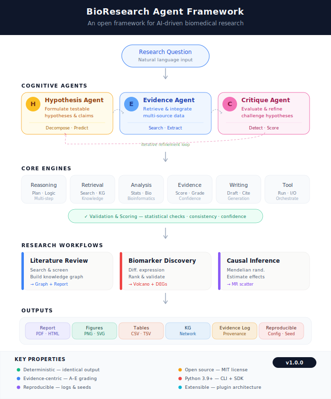
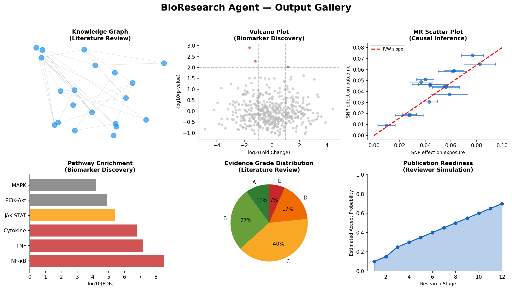
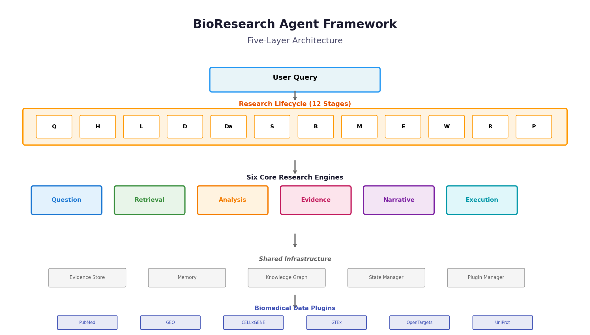

# BioResearch Agent Framework

> An open framework for AI-driven biomedical research.

[](https://github.com/Alim430/bioresearch-agent/actions/workflows/ci.yml)
[](https://www.python.org/downloads/)
[](https://opensource.org/licenses/MIT)
[](https://github.com/Alim430/bioresearch-agent/releases/tag/v1.0.0)

---

<div align="center">



*End-to-end architecture: 3 cognitive agents · 6 core engines · 3 research workflows · deterministic outputs*

</div>

---

## 🖼️ What It Produces

One image shows the real outputs of all three workflows — understand what this is in 3 seconds, no reading required:

<div align="center">



*Left: literature co-occurrence knowledge graph · Middle: differential-expression volcano plot · Right: MR scatter plot — covering Literature / Biomarker / Causal scenarios.*

</div>

---

## ⚡ Quick Start

```bash
# 1. Clone & install
git clone https://github.com/Alim430/bioresearch-agent.git
cd bioresearch-agent
pip install -e .

# 2. Environment check
bioresearch doctor

# 3. Run the three real workflows
bioresearch run literature --query "microglia Alzheimer's disease"
bioresearch run biomarker --disease "Parkinson's disease"
bioresearch run causal   --exposure BMI --outcome "Type 2 Diabetes"

# 4. Inspect outputs
ls outputs/literature/ outputs/biomarker/ outputs/causal/
```

**Demos require no LLM key** — they run on public APIs + synthetic fallback data.

---

## 🔄 End-to-End Workflow

From a single natural-language question to publication-ready figures and reports:


**Core design:** capabilities live in the *reasoning layer* (abstract, model-agnostic); methods live in the *plugin layer* (swappable, domain-specific); workflows orchestrate the two. Each of the 12 lifecycle stages has a gate: `PASS` proceeds · `REVISE` loops · `FAIL` aborts with a reason.

## 🔁 12-Stage Lifecycle

The three agents and six engines collaborate across 12 lifecycle stages, each with a gate check:

<div align="center">


*Wide pipeline diagram — click to enlarge.*

</div>

---

## 🏗️ Architecture: Five Layers

<div align="center">



</div>

| Layer | Responsibility |
|:---|:---|
| **User Interface** | CLI · Python SDK · LLM tool (Claude / Cursor / LangChain) |
| **Workflow** | literature / biomarker / causal (extensible) |
| **Reasoning · 6 Engines** | Question → Retrieval → Analysis → Evidence → Narrative → Execution |
| **Lifecycle · 12 Stages** | Ideation → … → Publication, each gated |
| **Plugin** | PubMed · GEO · KEGG · GO · GWAS · DESeq2 · IVW-MR |

---

## 🎯 What It Does

**BioResearch Agent Framework** is a **runnable AI system** that automates end-to-end biomedical research through structured reasoning workflows.

| Capability (reasoning layer) | Description |
|:---|:---|
| Biomedical literature reasoning | entity extraction, knowledge-graph construction, research-gap identification |
| Omics data interpretation | gene expression / variant / molecular-profile statistics with biological context |
| Causal inference for biosystems | Mendelian randomization and causal discovery |
| Multimodal evidence integration | literature + statistics + mechanistic evidence → unified confidence |
| Hypothesis generation & testing | cross-domain evidence → falsifiable hypotheses |
| Scientific narrative synthesis | structured reports with evidence grading, citation management, figures |

**Key difference:** we don't just generate text — we run the **full pipeline**: data retrieval, statistical analysis, evidence grading, publication-ready output.

---

## 🚀 Three Commands, Three Workflows

### 1. Literature Review
```bash
bioresearch run literature --query "microglia Alzheimer's disease"
```
PubMed retrieval → abstract extraction → entity co-occurrence knowledge graph → heuristic gap detection → structured review outline.
**Outputs:** `lit_review_summary_table.csv` · `lit_review_knowledge_graph.png` · `lit_review_knowledge_gaps.txt` · `lit_review_outline.md`

### 2. Biomarker Discovery
```bash
bioresearch run biomarker --disease "Parkinson's disease"
```
GEO dataset (GSE7621) or synthetic → differential expression (t-test + Bonferroni) → hypergeometric pathway enrichment (KEGG/GO) → candidate ranking → volcano plot.
**Outputs:** `biomarker_deg_table.csv` · `biomarker_top_candidates.csv` · `biomarker_pathway_enrichment.csv` · `biomarker_volcano_plot.png` · `biomarker_report.txt`

### 3. Causal Inference (MR)
```bash
bioresearch run causal --exposure BMI --outcome "Type 2 Diabetes"
```
Simulated GWAS summary stats → genome-wide significant SNP instruments → IVW estimation → leave-one-out sensitivity → MR scatter / funnel plots.
**Outputs:** `causal_ivw_results.csv` · `causal_loo_results.csv` · `causal_mr_scatter.png` · `causal_mr_funnel.png` · `causal_interpretation.txt`

---

## 📊 Output Gallery

| Workflow | Representative Figure | Size |
|:---|:---|:---:|
| Literature | entity co-occurrence knowledge graph (40 entities / 30 abstracts) | varies |
| Biomarker | publication-grade volcano plot (DEG analysis) | 86 KB |
| Causal | MR scatter plot (IVW slope labeled) + funnel | 127 KB |

> The knowledge graph is a high-resolution network graph — view it locally in `outputs/literature/`. The other figures are all < 1 MB and preview directly.

---

## 🆚 Why Choose It

| Task | Manual | ChatGPT / Claude | BioResearch Agent |
|:---|:---:|:---:|:---:|
| Literature review (20 papers) | 4–6 h | 5 min (text only) | **1.5 min** (report + graph + gaps) |
| Biomarker discovery | 1–2 days | cannot access GEO / run stats | **3 min** (end-to-end) |
| Causal inference (MR) | 1–2 h | no MR capability | **2 min** (analysis + figures) |

**Every output is evidence-graded (A–E)**, every stage is gate-checked, every claim is traceable to data.

---

## 📦 Installation

```bash
# Option 1: source install (current)
git clone https://github.com/Alim430/bioresearch-agent.git
cd bioresearch-agent
pip install -e .

# Option 2: pip (after publish)
pip install bioresearch-agent
```
**Dependencies:** Python 3.9+, pandas · numpy · scipy · matplotlib · requests · networkx

### Environment check
```bash
bioresearch doctor
```
Validates Python version, dependencies, demo files, network connectivity, and output-directory permissions.

---

## 🎮 Usage

### CLI
```bash
bioresearch run literature --query "microglia Alzheimer's disease"
bioresearch run biomarker --disease "Parkinson's disease"
bioresearch run causal   --exposure BMI --outcome "Type 2 Diabetes"
bioresearch doctor
```

### Python SDK
```python
from bioresearch import Agent

agent = Agent()
result = agent.run(
    workflow="literature",
    query="microglia Alzheimer's disease",
    output_dir="outputs/literature",
)

print(result.success)      # True
print(result.report_path)  # outline.md path
print(result.figures)      # ["knowledge_graph.png"]
```

### LLM Tool Integration
Register as a tool for Claude Desktop / Cursor / LangChain / any OpenAI-compatible function-calling system:
```json
{
  "name": "bioresearch_run",
  "description": "Execute biomedical research workflows",
  "parameters": {
    "workflow": "literature | biomarker | causal",
    "query": "research topic (for literature)",
    "disease": "disease name (for biomarker)",
    "exposure": "exposure trait (for causal)",
    "outcome": "outcome trait (for causal)"
  }
}
```
Full tool spec in `bioresearch/toolspec.json`.

---

## 📂 Project Structure

```
bioresearch-agent/
├── bioresearch/         # SDK + CLI package
├── bio-research-os/      # core framework (engines, demos, examples)
├── outputs/              # generated outputs (gitignored)
├── assets/               # documentation figures
├── README.md
├── RELEASE_NOTES.md      # v1.0.0 release notes
├── pyproject.toml
└── Makefile
```

---

## 🛣️ Roadmap

| Phase | Feature | Status |
|:---|:---|:---:|
| **v1.0.0** | 3 workflows · CLI · SDK · `doctor` · LLM tool spec | ✅ |
| **v1.1** | LLM adapters (OpenAI / Claude / local) · workflow YAML config | 🔜 |
| **v1.2** | Plugin SDK · additional workflows | 🔜 |

---

## 📜 License

MIT

---

> **BioResearch Agent Framework** — *From hypothesis to publication, one command.*
